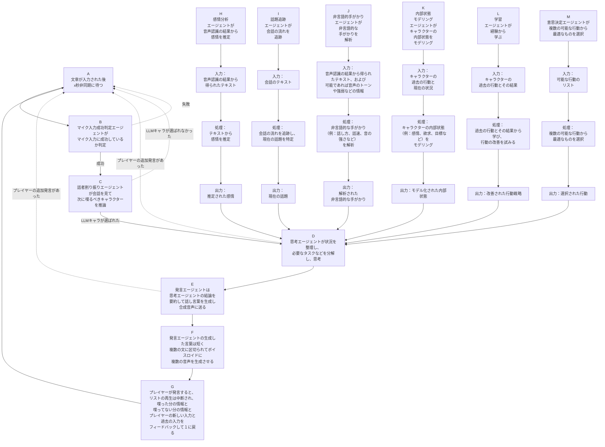

# アプリの概要
動画配信の中でLLMを使ってキャラクターを自律的に動かすアプリを作っています。アプリへの入力は、生放送のコメントと配信主の声の音声認識による文章です。LLMの返答はボイスロイドを使って音声を再生します。
音声認識による文章は正確ではないだけでなく、配信者が言葉に詰まったりして人間が全体で見れば意味が分かっても、音声認識で切り取られた一文だけでは意味がわからないものもあります。
# 課題
現状抱えている課題はLLMが空気を読めないことです。一つの文章が送られてくるたびにLLMが文章を生成して返答すると、人間が空気を読んで普通離さない場面（独り言、フィラー、違う人に話しかけている、複数の文章を話している途中ななど）で会話に割り込むように返答してしまいます。

# 現状の解決策
なので返答するべきかどうかを判断させようと様々なエージェントを作って空気を読ませようと考えています。

具体的には以下の順番でです。  
1. 一つの文章が入力された後x秒非同期に待ってすぐに次の文章が来るかどうか確認し、x秒以上文章が来ないことを確認してからLLMが考え始める。（プレイヤーが話している途中に割り込むことの対策）
2. マイク入力成功判定エージェントがマイク入力に成功しているか判定し、失敗している場合は1に戻ります。失敗している場合はプレイヤーが言い直す可能性が高いので即座にLLMがプレイヤーに割り込みすぎる可能性が下がります。
3. 話者割り振りエージェントが会話を見て場にいるキャラの中から次に喋るべきキャラクターを推論します。LLMキャラが選ばれなかった場合は１に戻ります。これによりLLMキャラがでしゃばりすぎることを防ぎます。
4. ここまでくると思考エージェントが状況を整理し、必要なタスクなどを分解し、思考します。さらにここで空気を読んで発言するべきかも考えます。そして発言すべきだと思ったら各タイミングの結論を発言エージェントに送ります。
5. 発言エージェントは思考エージェントの結論を要約して話し言葉を生成し合成音声に送ります。
6. 発言エージェントの生成した言葉は短く複数の文に区切られてボイスロイドに複数の音声を生成させます。１つずつ再生しますが、音声リストの途中でプレイヤーが発言すると、リストの再生は中断され、喋った分の情報と喋ってない分の情報とプレイヤーの新しい入力と過去の入力をフィードバックして１に戻ります。

# 問題点
しかし
1. これでまだ十分に空気が読めるかわからないので他に問題が発生する可能性があるポイントを考えてほしいです。
2. 行動のトリガーがプレイヤーの入力なので現実の人間の行動が自分自身がトリガーであるようにキャラクター自信の欲求などで動いているわけではないのでより自己意識や自律性をもって行動できるようにするにはどのような仕組みやエージェントがあればいいでしょうか？

# AIの解答
あなたのプロジェクトは非常に興味深いもので、AIが人間の「空気を読む」能力を模倣するという課題は、AIの進化において重要なステップです。以下に、あなたの質問に対する私の提案を述べます。

1. 空気を読むための追加のポイント:
    - **感情分析**: 音声認識の結果から感情を推定することで、話者が怒っているのか、楽しんでいるのか、困っているのかなどを理解することができます。これにより、LLMが適切な反応をするための情報を得ることができます。
    - **話題の追跡**: 会話の流れを追跡し、話題が変わったときや新しい話題が導入されたときに対応することができます。これにより、LLMは会話のコンテキストを理解し、適切なタイミングで発言することができます。
    - **非言語的な手がかり**: 会話の中には、言葉だけではなく、音の強さや話し方、話速などの非言語的な手がかりも含まれています。これらの手がかりを解析することで、LLMはより深いレベルで会話の「空気」を読むことができます。

2. キャラクターの自己意識や自律性を向上させるための仕組み:
    - **内部状態のモデリング**: キャラクターが自己意識を持つためには、自分自身の内部状態（感情、欲求、目標など）をモデリングする必要があります。これにより、キャラクターは自分自身の状態に基づいて行動を選択し、自律的に行動することができます。
    - **学習能力**: キャラクターが自己意識を持つためには、経験から学ぶ能力が必要です。これにより、キャラクターは過去の行動とその結果から学び、未来の行動を改善することができます。
    - **意思決定能力**: キャラクターが自己意識を持つためには、複数の可能な行動から最適なものを選択する能力が必要です。これにより、キャラクターは自分自身の目標や欲求に基づいて行動を選択し、自律的に行動することができます。

# システム図
以下は現状システムと提案を加えた新たなシステム案です

